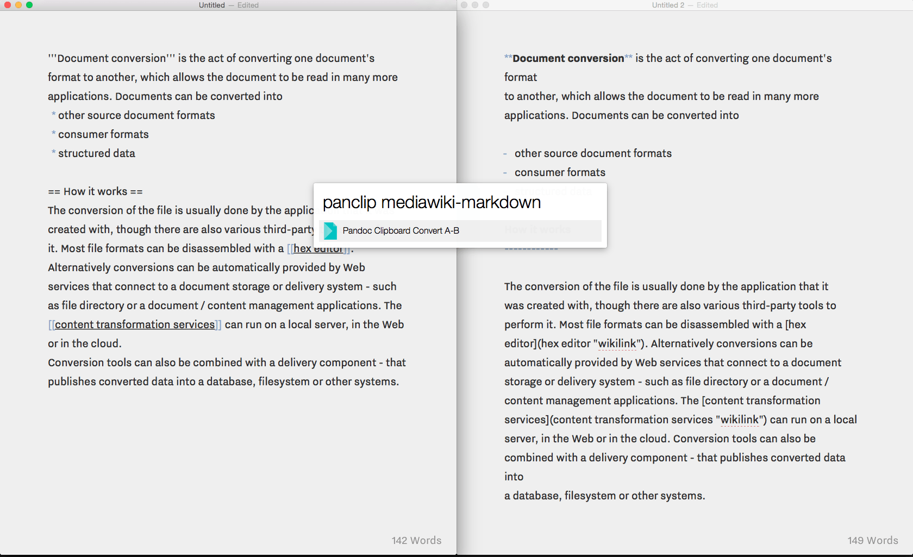

# PanClip

Convert clipboard contents to html, mediawiki, markdown…  

[Alfred.app](https://www.alfredapp.com) - Workflow: convert plain text clipboards via [Pandoc](http://pandoc.org).

## Prerequisites

[Pandoc](http://pandoc.org) must be installed. 

## Usage 

1. Copy text you want to convert (e.g. HTML, Markdown, Mediawiki)
2. Open Alfred
2. Type `panclip` `Original Format`-`Target Format`
3. The converted text will be placed in your clipboard. 

Example: `panclip html-markdown`

**NOTE:** Panclip only supports plain text sources and outputs (HTML, Markdown, Mediawiki, ...)

## Screenshot

## Pandoc Icon

